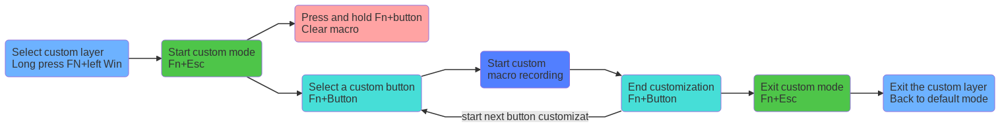

# Akko/Ducky Mechanical Keyboards Macros Guide




These instructions are for Akko Makro v1.0 only.
See https://www.akkogear.com/manual3108_1808_v2

Diagram in [mermaid-js](https://mermaidjs.github.io) code 

```
graph LR;
a(Select custom layer<br>Long press FN+left Win);
b(Start custom mode<br> Fn+Esc);
c(Press and hold Fn+button<br>Clear macro);
d(Select a custom button<br>Fn+Button);
e(Start custom<br>macro recording);
f(End customization<br>Fn+Button);
g(Exit custom mode<br>Fn+Esc)
h(Exit the custom layer<br>Back to default mode);

style a fill:#6db2ff;
style c fill:#ffa3a3;
style b fill:#4ec549;
style d fill:#46ded7;
style e fill:#527fff;
style f fill:#46ded7;
style g fill:#4ec549;
style h fill:#6db2ff;

a-->b;
b-->c;
b-->d;
d-->e;
e-->f;
f--start next button customization-->d;
f-->g;
g-->h;

```
