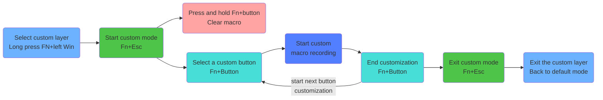

# Akko/Ducky Mechanical Keyboards Macros Guide

These instructions are for Akko Makro v1.0 only.
See https://www.akkogear.com/manual3108_1808_v2

## Function Key Combinations

* `Fn + F1`	- File Explorer
* `Fn + F2`	- E-mail
* `Fn + F3`	- Windows Search
* `Fn + F4`	- Browser Homepage
* `Fn + F5`	- Media Player
* `Fn + F6`	- Play/Pause
* `Fn + F7`	- Previous Song
* `Fn + F8`	- Next Song

## System Commands

* Lock Windows Key: Press and hold `Fn + Win` together for 3 seconds.
* Restore Factory Settings: Press and hold the `left Win + right Win` together for 3 seconds.

## Macro Programming

```mermaid
graph LR;
a(Select custom layer<br>Long press FN+left Win);
b(Start custom mode<br> Fn+Esc);
c(Press and hold Fn+button<br>Clear macro);
d(Select a custom button<br>Fn+Button);
e(Start custom<br>macro recording);
f(End customization<br>Fn+Button);
g(Exit custom mode<br>Fn+Esc)
h(Exit the custom layer<br>Back to default mode);

style a fill:#6db2ff;
style c fill:#ffa3a3;
style b fill:#4ec549;
style d fill:#46ded7;
style e fill:#527fff;
style f fill:#46ded7;
style g fill:#4ec549;
style h fill:#6db2ff;

a-->b;
b-->c;
b-->d;
d-->e;
e-->f;
f--start next button<br> customization-->d;
f-->g;
g-->h;

```
